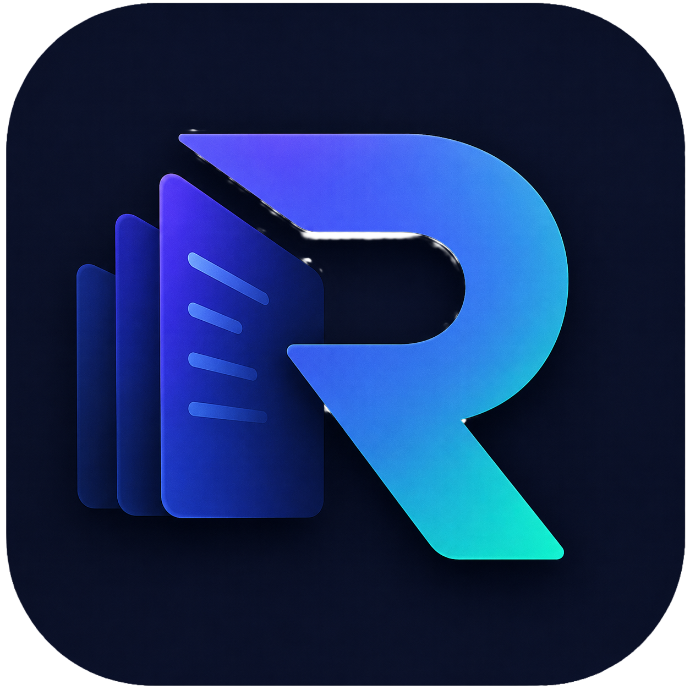

<p align="center">
  
</p>

<h1 align="center">Recall</h1>

<p align="center">
  <strong>Persistent developer memory for VS Code. Copilot searches before reading, saves what it learns, and gets smarter every session.</strong>
</p>

<p align="center">
  <a href="LICENSE"></a>
  
  = 1.95">
  
</p>

<p align="center">
  <a href="#setup">Setup</a> •
  <a href="#being-effective-with-recall">Being Effective</a> •
  <a href="#how-it-works">How It Works</a> •
  <a href="#features">Features</a> •
  <a href="#commands">Commands</a> •
  <a href="#configuration">Configuration</a>
</p>

---

## Setup

### 1. Install

```bash
# From the VS Code Marketplace
code --install-extension ethankhoury.recall-persistent-memory

# Or from a .vsix file
code --install-extension recall-persistent-memory-1.4.1.vsix --force
```

### 2. Set up your repository

This teaches Copilot how and when to use Recall's tools in your project:

```
Ctrl+Shift+P > "Recall: Setup Repository"
```

This creates instruction files under `.github/` that Copilot reads automatically. Commit them to your repo so the whole team benefits.

### 3. Start working

That's it. Recall builds memory as you work. Copilot will search memory before reading files, save what it learns at milestones, and ask you clarifying questions instead of guessing.

If you are updating from a previous version, run **Setup Repository** again and choose **"Update to latest"** to refresh the instruction files.

---

## Being Effective with Recall

### The workflow Recall teaches Copilot

1. **Search memory** before reading files (architectural context first, then symptoms)
2. **Look up the file index** before `read_file` (read 80 lines, not 8,000)
3. **Ask you** when unsure about intent or approach (instead of guessing)
4. **Do the work**
5. **Save observations** at each milestone (not one dump at the end)

### Things you can do to help

- **Verify pending observations.** Copilot's saves stay "pending" until you confirm them. Verified observations are trusted as ground truth in future sessions — pending ones are treated as hypotheses.
- **Search explicitly when Copilot forgets.** Type `@recall_search auth architecture` in chat to force a memory lookup. Start broad (module + "architecture"), then narrow to symptoms.
- **Seed memory on a cold start.** Run `Recall: Setup Repository`, then open `recall-seed.prompt.md` in Copilot Chat and point it at a module. It walks the codebase building baseline observations.
- **Answer when asked.** `recall_ask` pops a QuickPick when Copilot is unsure. Your answer becomes ground truth and (if reusable) gets saved as verified memory so it never asks again.
- **Re-run Setup Repository after extension updates** to get the latest instruction improvements.

---

## How It Works

```
Without Recall:                            With Recall:

Copilot --read_file--> 7,854 lines         Copilot --recall_search-->     3 observations  (~250 tok)
   ^                       |                   |    --recall_file_index--> symbol listing  (~150 tok)
   |    ~55,000 tokens     |                   |    --read_file L130-195-->               (~200 tok)
   <-----------------------+                   |    --recall_save-->       stored for next time
                                               v
                                            Total: ~600 tokens
```

Recall registers four Language Model Tools that Copilot calls autonomously:

| Tool | What It Does |
|---|---|
| `recall_search` | Searches memory for prior observations before deep-diving into code |
| `recall_file_index` | Looks up cached function listings so Copilot reads only specific lines |
| `recall_save` | Saves insights at milestones using a structured format (kind + tags) |
| `recall_ask` | Asks you a clarifying question with selectable options instead of guessing |

### Example Session

```
You type: "Fix the token refresh race condition in auth"

Copilot (behind the scenes):
  1. recall_search("auth architecture")
     > 2 architectural observations about how auth tokens flow

  2. recall_search("getAccessToken refresh race condition")
     > 1 prior bugfix observation from last week

  3. recall_file_index("authService.ts")
     > 12 functions with line numbers (400 tokens vs 8,000 for full file)

  4. read_file authService.ts lines 130-195
     > only the 2 functions it needs

  5. Makes the fix

  6. recall_save("[WHAT] Race condition fixed... [WHERE] ... [WHY] ...")
     > saved as 'pending' for you to verify
```

---

## Features

- **Autonomous Memory** — Copilot searches and saves on its own. No manual @commands needed.
- **Clarifying Questions** — `recall_ask` lets Copilot ask you instead of assuming. Your answers become verified memory.
- **Hybrid Search** — FTS5 keyword search + 384-dim semantic embeddings. Finds memories even when wording differs.
- **File Index** — Every source file gets a cached function/class listing with line numbers (30+ languages via DocumentSymbol).
- **Structured Observations** — Saves with a `kind` field (architecture, bugfix, gotcha, dataflow, contract, hypothesis, decision) for consistent formatting.
- **Trust System** — AI observations stay "pending" until you verify. Objective events (builds, commits) are auto-verified.
- **Passive Capture** — Builds, debug sessions, git commits, and idle notes are logged automatically.
- **Deduplication** — Clusters near-identical observations by semantic similarity. One-click merge.
- **Token Savings Tracker** — Per-session and all-time metrics. Run `@recall stats` to see your numbers.
- **Import / Export** — Share memory across machines or with teammates via JSON.
- **100% Private** — Bundled ONNX model. WebAssembly SQLite. Zero network calls. Zero telemetry.

---

## Token Savings

Measured on a resume-work debugging session in a medium-large codebase:

| Metric | Without Recall | With Recall | Reduction |
|---|---|---|---|
| **Tokens per session** | ~111,000 | ~9,700 | **91%** |
| **Source lines read** | 12,690 | 83 | **99.3%** |
| **Time to first response** | 60-90 sec | 10-15 sec | **~6x** |
| **Full file reads** | 4 files | 0 files | **100%** |

> Actual savings vary by project size and memory maturity. The extension tracks your numbers per session.

---

## Semantic Search

Every observation is embedded as a 384-dimensional vector using a bundled sentence-transformer model (all-MiniLM-L6-v2, ~23 MB ONNX). When Copilot calls `recall_search`, Recall runs a hybrid query:

1. **FTS5 keyword match** with prefix expansion ("auth" finds "authentication", "authorize")
2. **Cosine similarity** over embedding vectors ("login broken" finds "OAuth token refresh fails silently")
3. Results merged and ranked by combined score

The model runs entirely in-process. No API calls, no network, no data leaves your machine.

---

## Trust & Verification

Copilot-generated observations are saved as **pending** with a notification: `[Verify] [Edit & Save] [Discard]`. Unconfirmed observations auto-expire after 7 days (configurable). Verified observations are treated as ground truth in future sessions.

---

## Commands

### @recall Chat Participant

```
@recall search <keywords>             Search observations (keyword + semantic)
@recall search <keywords> --tags x,y  Filter by tags
@recall save <text>                   Save a verified observation
@recall save <text> --tags x,y        Save with tags
@recall recent                        Show recent observations
@recall recent --days 7               Last 7 days
@recall pending                       Show unverified observations
@recall verify <id>                   Mark as verified
@recall edit <id>                     Edit and verify
@recall discard <id>                  Delete observation
@recall timeline <id>                 Observations from same day
@recall index <filename>              Look up cached file index
@recall stats                         Database statistics + token savings
@recall export                        Export all data to JSON
@recall help                          Show all commands
```

### Command Palette

| Command | Description |
|---|---|
| `Recall: Quick Save Observation` | Save an insight with tags (`Ctrl+Shift+M`) |
| `Recall: Show Pending Observations` | Review unverified observations |
| `Recall: Open Dashboard` | Stats, pending reviews, token savings |
| `Recall: Re-index Current File` | Rebuild index for the active file |
| `Recall: Re-index All Open Workspace Files` | Index all source files |
| `Recall: Reindex Semantic Embeddings` | Backfill embeddings for existing observations |
| `Recall: Deduplicate Memory` | Find and merge near-identical observations |
| `Recall: Export Memory to JSON` | Export everything |
| `Recall: Import Memory from JSON` | Import from a teammate's export |
| `Recall: Setup Repository` | Add/update Copilot guidance files |
| `Recall: Show Database Statistics` | Counts, index stats, token savings |
| `Recall: Clear All File Index Entries` | Wipe and re-index from scratch |
| `Recall: Compact Database (Vacuum)` | Free unused space |
| `Recall: Run Diagnostics` | Debug tool registration |

---

## Configuration

All settings under `recall.*` in VS Code settings:

| Setting | Default | Description |
|---|---|---|
| `recall.databasePath` | `~/.recall/recall.db` | Custom database path |
| `recall.autoIndexOnSave` | `true` | Index files on save |
| `recall.captureBuilds` | `true` | Auto-capture build results |
| `recall.captureGitCommits` | `false` | Auto-capture git commits |
| `recall.captureDebugSessions` | `true` | Auto-capture debug sessions |
| `recall.pendingExpirationDays` | `7` | Days before pending observations expire |
| `recall.idlePromptMinutes` | `10` | Minutes before "save notes?" prompt (0 = disable) |
| `recall.maxSearchResults` | `10` | Max results from recall_search |
| `recall.projectName` | `""` | Override auto-detected project name |
| `recall.indexFileExtensions` | `[]` | Additional file extensions to index |

---

## Privacy & Data

| | |
|---|---|
| **Storage** | Single WebAssembly SQLite file at `~/.recall/recall.db` |
| **Embedding model** | Bundled ~23 MB ONNX model, runs in-process |
| **Network calls** | Zero |
| **Telemetry** | Zero |
| **Cloud sync** | None |
| **Backup** | Copy `recall.db` |
| **Reset** | Delete `~/.recall/recall.db` |

---

## System Requirements

- **VS Code** 1.95+ (Copilot Agent mode support)
- **Copilot** Any plan with Agent mode (Business, Enterprise, or Individual)

---

## Development

See [CONTRIBUTING.md](CONTRIBUTING.md) for full development setup, build commands, and project structure.

```bash
git clone https://github.com/KhouryEthan/Recall.git && cd Recall && npm install
```

Press `F5` in VS Code to launch the Extension Development Host.

---

## Documentation

- [Architecture](docs/architecture.md)
- [Privacy model](docs/privacy.md)
- [Security model](docs/security-model.md)
- [Troubleshooting](docs/troubleshooting.md)
- [Roadmap](ROADMAP.md)
- [Contributing](CONTRIBUTING.md)

## License

Apache License 2.0. See [LICENSE](LICENSE) and [NOTICE](NOTICE) for details.
